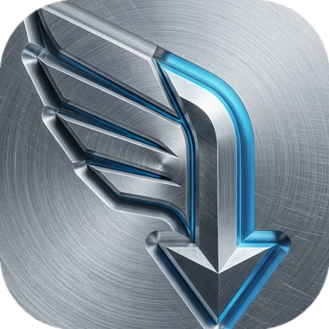
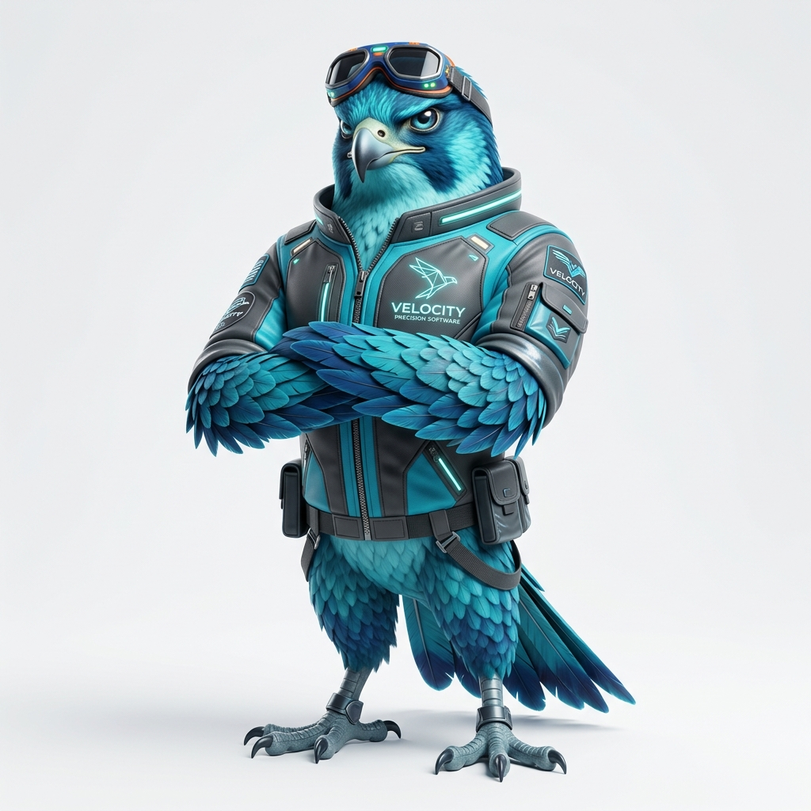

<p align="center">
  
</p>

<h1 align="center">Falcon DM</h1>

<p align="center">
  <strong>A high-performance macOS download manager engineered for speed and precision.</strong><br>
  Falcon DM combines a Rust (Tauri v2) backend with a React/TypeScript frontend to provide native OS integration, rigorous process isolation, and maximum network throughput.
</p>

<p align="center">
  <a href="https://github.com/batuhanyuksel/downloadmanager/actions/workflows/ci.yml"></a>
  <a href="https://github.com/batuhanyuksel/downloadmanager/actions/workflows/release.yml"></a>
  
  
</p>

<br>

<table align="center" border="0" cellpadding="0" cellspacing="0">
  <tr>
    <td width="50%" align="center" valign="middle">
      
    </td>
    <td width="50%" valign="middle" style="padding-left: 20px;">
      <h3>Meet Falco (The Sniffer)</h3>
      <p>The official mascot of Falcon DM embodies the engineering pillars of the project:</p>
      <ul>
        <li><strong>Speed:</strong> Multi-threaded chunking via <code>aria2c</code>.</li>
        <li><strong>Precision:</strong> Byte-perfect HLS assembly via <code>ffmpeg</code>.</li>
        <li><strong>Stealth:</strong> Silent browser interception via PNA CORS.</li>
      </ul>
    </td>
  </tr>
</table>

---

## Core Architecture

### Download Engine (Aria2c Sidecar)
The core download pipeline is delegated to a bundled, statically linked `aria2c` binary. This sidecar handles:
- Dynamic block-level file segmentation (up to 16 concurrent connections per server).
- Resilient connection pooling and chunk validation.
- JSON-RPC communication with the Rust host over a protected local port.

### HLS Stream Capture (FFmpeg Sidecar)
Stream interception (m3u8) is processed asynchronously. The Rust host reads the master playlist, downloads segments concurrently via `tokio::spawn`, and delegates final lossless concatenation to a bundled `ffmpeg` sidecar. This pipeline prevents memory bloat during multi-gigabyte video assembly.

### Queue Management & State Synchronization
The `QueueManager` operates on a strict 500ms tick cycle. It maintains bounded concurrency using atomic counters and provides deterministic cancellation tokens (`tokio::sync::watch`) for in-flight HLS tasks. Persistent state is managed via SQLite (`rusqlite`), ensuring zero data loss upon abrupt termination.

### IPC & Browser Integration
Falcon DM hosts a local Axum HTTP server (`127.0.0.1:14201`) to intercept requests from browser extensions. This endpoint strictly enforces Private Network Access (PNA) CORS policies to prevent CSRF vectors from arbitrary domains.

## Build Requirements

- macOS 13.0+ (Ventura or later)
- Node.js 18.0+
- Rust 1.70+
- `cargo-tauri`

## Compilation & Bootstrapping

Falcon DM enforces a zero-dependency execution model by bundling its engines via Tauri Sidecars. Prior to compilation, statically linked binaries must be injected into the build path.

### 1. Sidecar Provisioning

A helper script provisions the `aria2c` and `ffmpeg` sidecar binaries for your
machine's architecture (Apple Silicon or Intel), copying aria2 from Homebrew and
fetching ffmpeg. Run it once before the first build:

```bash
./scripts/provision-sidecars.sh
```

This places the binaries with the correct target-triple suffix into
`src-tauri/binaries/` (`aria2c-<arch>-apple-darwin`, `ffmpeg-<arch>-apple-darwin`).
It is idempotent — re-running skips binaries that are already present.

> Prerequisites for the script: `brew install aria2 ffmpeg yt-dlp`. The release
> CI (`release.yml`) runs the same script automatically on both architectures.

### 2. Compilation

```bash
# Install frontend dependencies
npm install

# Initialize development environment
npm run tauri dev

# Compile production binary (.app / .dmg)
npm run tauri build
```

### 3. Browser extension + wake

1. Load unpacked `extension/` in Chrome (`chrome://extensions` → Developer mode).
2. Open Falcon DM → **Settings → Approve extension** when the pair request appears (no silent first-wins).
3. YouTube downloads require system `yt-dlp` (`brew install yt-dlp`). aria2/ffmpeg are bundled sidecars; yt-dlp is not.
4. **Deep link wake:** `falcondm://wake` only (production `.app`). Download enqueue via deep-link query is disabled — secrets must not appear in URLs; extension uses wake → HTTP API. `tauri dev` often does not register the scheme.

## Development & Contributing

For local development, linting, testing, and contribution guidelines see
[CONTRIBUTING.md](CONTRIBUTING.md). Quick reference:

```bash
# Frontend
npm run lint            # ESLint (--max-warnings 0)
npm run format:check    # Prettier
npm run test            # Vitest (46 tests)
npm run build           # tsc + vite build

# Backend (in src-tauri/)
cargo fmt --check
cargo clippy --all-targets -- -D warnings
cargo test              # 29 tests
```

Supply-chain checks: `cargo deny check` (Rust advisories/licenses) and
`npm audit --omit=dev --audit-level=high` run in CI on every push.

To report a security issue, see [SECURITY.md](SECURITY.md) — **do not open a
public issue** for vulnerabilities.

## Security Posture

- **Network Boundary:** The Axum IPC server validates preflight `OPTIONS` requests and enforces `Access-Control-Allow-Private-Network`, mitigating cross-origin threats. Extension pairing requires explicit user approval; private/loopback download URLs are blocked.
- **Process Isolation:** The application executes within Tauri's security sandbox. Shell execution is explicitly bounded to the defined sidecars (`aria2c`, `ffmpeg`); arbitrary command execution is disabled by design. aria2 port reclaim only kills Falcon's own PID file.
- **Data Governance:** No telemetry. No external analytics. All state and network operations remain strictly local. Completed-download cookies are wiped on startup.

## License

This project is licensed under the MIT License - see the [LICENSE](LICENSE) file for details.
