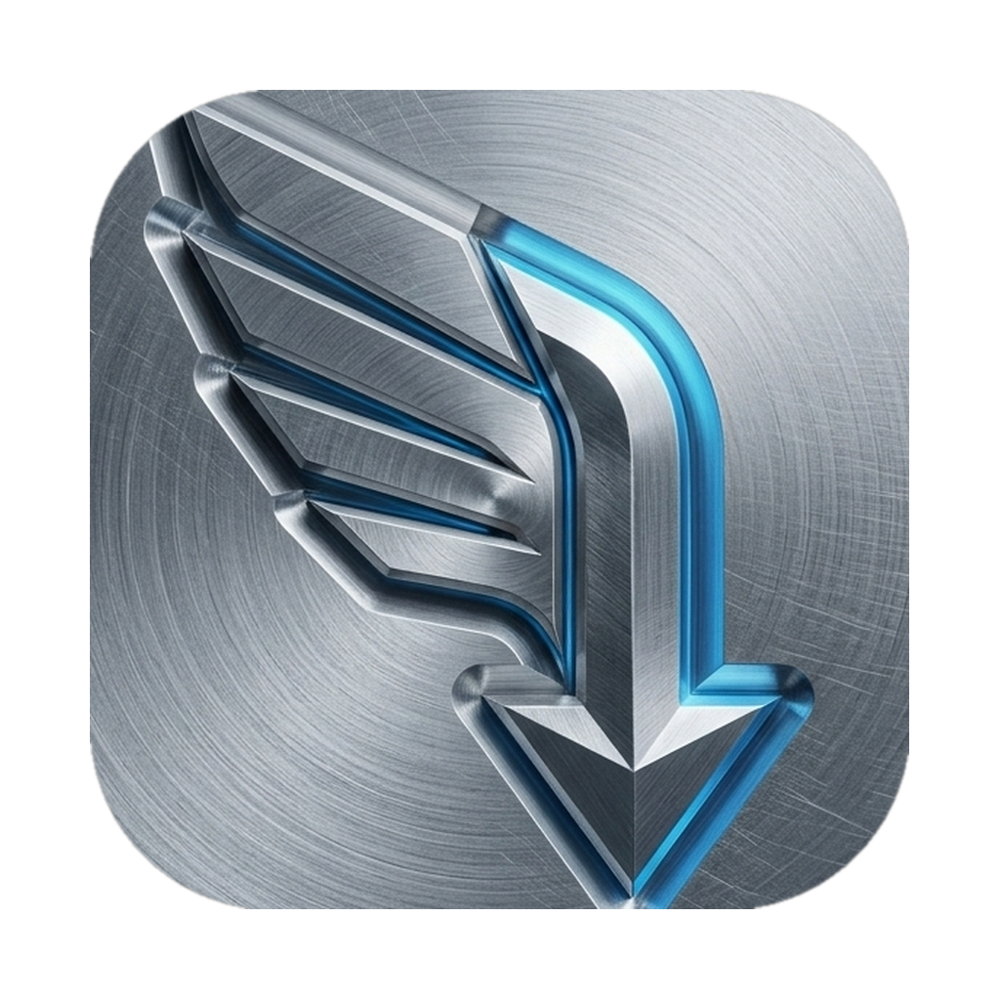

<p align="center">
  
</p>

<h1 align="center">Falcon DM</h1>

<p align="center">
  <strong>macOS download manager — multi-thread HTTP, HLS, YouTube, browser capture.</strong><br>
  Tauri v2 (Rust) backend + React/TypeScript UI. Local-only: no telemetry, no cloud queue.
</p>

<p align="center">
  <a href="https://github.com/batu3384/falcon-dm/actions/workflows/ci.yml"></a>
  <a href="https://github.com/batu3384/falcon-dm/actions/workflows/release.yml"></a>
  
  
</p>

<br>

<table align="center" border="0" cellpadding="0" cellspacing="0">
  <tr>
    <td width="50%" align="center" valign="middle">
      
    </td>
    <td width="50%" valign="middle" style="padding-left: 20px;">
      <h3>Meet Falco (The Sniffer)</h3>
      <p>The mascot reflects what the stack actually does:</p>
      <ul>
        <li><strong>Speed:</strong> DNS-pinned HTTP streaming with bounded redirects.</li>
        <li><strong>Precision:</strong> HLS segment assembly + <code>ffmpeg</code> merge.</li>
        <li><strong>Capture:</strong> Chrome MV3 extension → authenticated localhost API.</li>
      </ul>
    </td>
  </tr>
</table>

---

## Features

| Area | What you get |
|------|----------------|
| **HTTP(S)** | DNS-pinned streaming, bounded redirects, atomic completion, priority queue, scheduler |
| **HLS (m3u8)** | Parallel segment fetch, ffmpeg mux |
| **YouTube** | Watch URL + <code>yt-dlp</code> (quality via API <code>format</code> field) |
| **Browser extension** | Download hijack, video quality picker, link grabber (batch ≤20) |
| **Desktop UI** | Inspector panel, speed graph, EN/TR i18n, category paths |
| **Security** | Extension pair approval, SSRF URL block, token + Origin allowlist |

## Core Architecture

### Download engine

Ordinary HTTP(S) traffic uses the Rust DNS-pinned streaming path. The bundled `aria2c` binary remains available for legacy session recovery and protocol-specific compatibility. Private targets, unsafe redirects, and magnet URLs are rejected.

### Stream pipeline (HLS + YouTube)

- **HLS:** Rust downloads segments concurrently; `ffmpeg` sidecar muxes to disk.
- **YouTube:** CDN (<code>googlevideo</code>) URLs are rewritten to watch URLs; <code>yt-dlp</code> runs as an external tool (PATH or **Settings → yt-dlp path**). Not bundled.

### Queue & persistence

`QueueManager` ticks every 500ms, bounds concurrency with atomics, and cancels in-flight stream jobs via `tokio::sync::watch`. State lives in SQLite (`rusqlite`) with crash-safe recovery.

### Local API (browser extension)

Axum serves `http://127.0.0.1:14201`:

| Endpoint | Purpose |
|----------|---------|
| `POST /api/pair` | Extension pairing (`200` token or `202` pending approval) |
| `POST /api/intercept` | Media / hijacked download |
| `POST /api/add` | Direct URL (e.g. grabber batch) |
| `GET /api/health` | Liveness |

Requests require `X-Falcon-Token` and a `chrome-extension://` (or Firefox/Edge) `Origin` on the allowlist after you approve in Settings. See [extension/README.md](extension/README.md).

## Build requirements

- macOS 13.0+ (Ventura or later)
- **Node.js 22+** (matches CI; Node 24 breaks Vitest/jsdom on GitHub Actions)
- **Rust** stable (`rustup`)
- **Tauri CLI:** `npm install` (devDependency) or `cargo install tauri-cli`
- **Homebrew:** `brew install aria2 ffmpeg yt-dlp`

## Compilation & bootstrapping

Sidecars are **not** committed (`.gitignore`). Local provisioning is explicitly unsigned/unverified unless hashes are supplied:

```bash
./scripts/provision-sidecars.sh
```

Copies `aria2c` from Homebrew and `ffmpeg` (Homebrew on arm64, pinned evermeet.cx
binary on Intel) into `src-tauri/binaries/` as `aria2c-<triple>` and
`ffmpeg-<triple>`. Idempotent. Homebrew verifies its bottle; remote provisioning
requires `FFMPEG_SHA256` and verifies the extracted binary before installation.
`ARIA2_SHA256` can pin the copied Homebrew binary as well:

```bash
ARCH=x86_64 \
FFMPEG_URL='https://example.invalid/immutable-ffmpeg.zip' \
FFMPEG_SHA256='<64-hex SHA-256 of extracted ffmpeg>' \
./scripts/provision-sidecars.sh
```

Release workflows set `RELEASE_MODE=1` and require `ARIA2_SHA256`, immutable
`FFMPEG_URL`, and `FFMPEG_SHA256`; missing values fail before any binary is used.
Signed releases also import the Apple certificate into an ephemeral runner
keychain before Tauri build. If no signing secrets are configured, the workflow
selects the explicit unsigned fallback.

Never use an unpinned remote URL in release automation. Release jobs also
publish architecture-specific checksums for the app, sidecars, and native host.
Configure repository variables `FFMPEG_URL` and `FFMPEG_SHA256` before creating
an Intel release; missing values intentionally fail the release instead of
installing an unverifiable remote binary.

```bash
npm install
npm run tauri dev      # development
npm run tauri build    # .app / .dmg (see release.yml for signed builds)
```

### Browser extension

1. Chrome/Edge → `chrome://extensions` → **Load unpacked** → `extension/`
2. Build/install native host manifests:

   ```bash
   cargo build --manifest-path src-tauri/Cargo.toml --bin falcon-dm-native-host
   NATIVE_HOST_BIN="$PWD/src-tauri/target/debug/falcon-dm-native-host" \
   CHROME_EXTENSION_ID="<chrome-id>" \
   EDGE_EXTENSION_ID="<edge-id>" \
   ./scripts/install-native-host.sh
   ```

3. Open Falcon DM → **Settings → Approve extension** when pair request appears
4. YouTube: install `yt-dlp`; optional custom binary path in Settings
5. **Wake deep link:** `falcondm://wake` only (no download params — avoids token-in-URL leaks). Extension wakes app then uses HTTP API. `tauri dev` may not register the URL scheme.

## Development & contributing

Details: [CONTRIBUTING.md](CONTRIBUTING.md). Security issues: [SECURITY.md](SECURITY.md) (no public issues for vulns).

```bash
# Frontend
npm run lint && npm run format:check && npm run test && npm run build

# Backend (src-tauri/)
cargo fmt --check
cargo clippy --all-targets -- -D warnings
cargo test
```

CI on `main` (protected branch) runs: Frontend lint/test/build, Rust fmt/clippy/test/build on macOS arm64, and `cargo deny` supply-chain audit. Intel builds are validated in the **Release** workflow (`release.yml`).

## Security posture

- **Extension trust:** No silent auto-pair; user must approve extension ID in Settings. API token is UUID; legacy default token rejected.
- **Network boundary:** Download URLs validated (no `file://`, loopback, or private IP SSRF). Local API binds `127.0.0.1` only.
- **Deep links:** `falcondm://wake` only — enqueue happens over authenticated HTTP, not query strings.
- **Process isolation:** Shell use limited to declared sidecars (`aria2c`, `ffmpeg`, `yt-dlp`). aria2 PID reclaim only touches Falcon's own `aria2.pid`.
- **Data:** No telemetry. Session cookies stay in backend storage, are never
  serialized into frontend download payloads, and are cleared on terminal
  download states. yt-dlp does not persist browser cookies.

## License

MIT — see [LICENSE](LICENSE).
