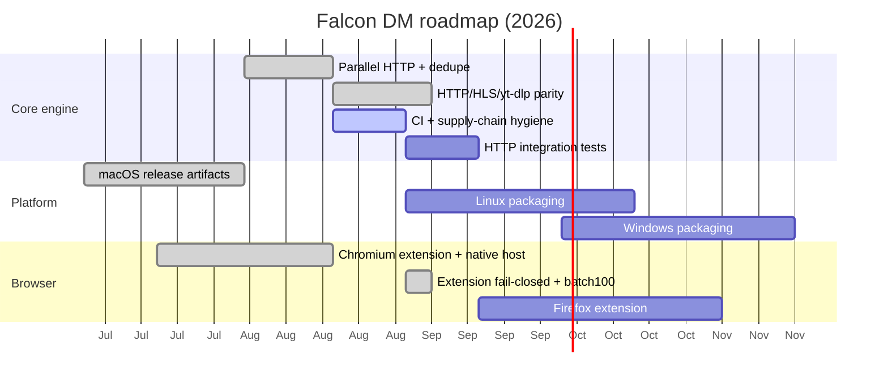

# Roadmap

Product direction for **Falcon DM**. This page tracks milestones — not a release calendar. Status updates when work lands on `main`.

## Status legend

| Label | Meaning |
|-------|---------|
| **Done** | Shipped on `main` |
| **Now** | Active or next up |
| **Next** | Planned, not started |
| **Later** | Backlog / exploratory |

## Done (recent parity work)

| Item | Notes |
|------|-------|
| Parallel HTTP (range, speed limit, byte verify) | CA-001 closed |
| HTTP parallel **resume** after `.part` | Remaining bytes use range segments when possible |
| HLS proxy, speed limit, segment resume | Temp dir `hls-{download_id}`; skips existing segments |
| yt-dlp proxy, speed limit, cookie opt-in | Settings toggle; cookies off by default |
| Extension fail-closed intercept | Popup/options **Block when offline** |
| Link grabber batch limit | 100 URLs per batch |
| Scheduler scope hint | Time window only; no shutdown/dial-up |
| Release update check | Settings → GitHub Releases compare + open release |
| Duplicate URL guard (DB + transaction) | CA-002 closed |
| Cross-platform native host manifests | macOS, Linux, Windows paths — CA-003 closed |
| Slim native host crate | `falcon-dm-native-host` (no AppKit; Chrome spawn safe) |
| Wiki + onboarding docs | Source in `wiki/`, sync via `./scripts/sync-wiki.sh` |

## Now

| Item | Status | Notes |
|------|--------|-------|
| CI green (fmt, clippy, cargo-deny) | **Now** | Supply-chain advisories and formatting gates |

## Next

| Item | Status | Notes |
|------|--------|-------|
| Linux desktop build + packaging | **Next** | Tauri matrix; validate sidecars on distros |
| Windows desktop build + packaging | **Next** | Native host + installer smoke |
| Parallel HTTP integration tests | **Next** | Mock 206 server — CA-008 |
| Firefox MV3 extension | **Next** | Pairing + intercept parity with Chromium |

## Later

| Item | Status | Notes |
|------|--------|-------|
| BitTorrent / magnet support | **Later** | Out of scope today; SSRF policy must extend first |
| Cloud sync / remote queue | **Later** | Conflicts with local-only product goal |
| aria2 session path retirement | **Later** | HTTP engine is Rust-first; aria2 for legacy recovery only |
| Signed in-app auto-update | **Later** | `tauri-plugin-updater` + CI manifest + pubkey (release check exists today) |
| Scheduler shutdown-after-complete | **Later** | IDM-style post-queue shutdown |
| Scheduler dial-up mode | **Later** | Connect-on-demand scheduling |

## Timeline (approximate)

## How to influence the roadmap

1. Open a [GitHub Issue](https://github.com/batu3384/falcon-dm/issues) with the **enhancement** label.
2. Describe the user problem, not the implementation.
3. Security-sensitive items: follow [SECURITY.md](https://github.com/batu3384/falcon-dm/blob/main/SECURITY.md) — no public exploit details.

## Related docs

- [Architecture](Architecture) — current system design
- [Getting Started](Getting-Started) — build and run today
- [Browser Extension](Browser-Extension) — pairing and intercept flow
